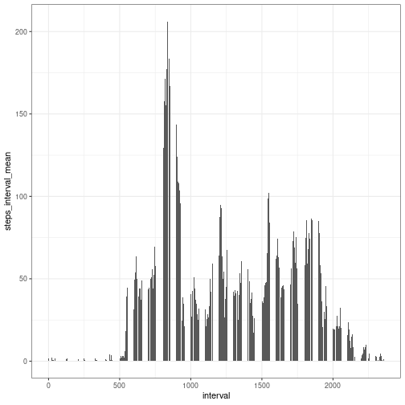
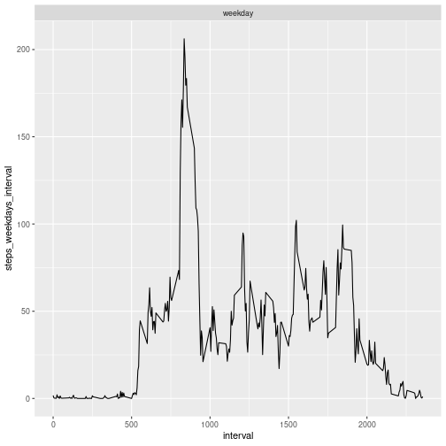

##Used librarys is this assignment


```r
library(readr)
library(dplyr)
library(ggplot2)
```

## Loading and preprocessing the data
First we load the data via readr. It is stored in a variable called 'activity'.
We use the library readr for this task.


```r
activity <- read_csv("activity.csv")
```

Let's have a look at the first 10 lines after reading the dataset.


```r
head(activity)
```

```
## # A tibble: 6 x 3
##   steps date       interval
##   <dbl> <date>        <dbl>
## 1    NA 2012-10-01        0
## 2    NA 2012-10-01        5
## 3    NA 2012-10-01       10
## 4    NA 2012-10-01       15
## 5    NA 2012-10-01       20
## 6    NA 2012-10-01       25
```

## What is mean total number of steps taken per day?
First we calculate the number of steps per day, then the resulting mean. We are using the dplyr package for the calculation.


```r
steps_daily<-
          activity%>%
          group_by(date)%>%
          summarise(steps_day = sum(steps, na.rm = TRUE))
```

```
## `summarise()` ungrouping output (override with `.groups` argument)
```
### Make a histogram of the total number of steps taken each day
Therefore we are using the 'hist()' function from base-r. In this case, it was convenient to plot 20 bars. We can see, that there are serveral missing values.


```r
hist(steps_daily$steps_day ,breaks = 20)
```


### Calculate and report the mean and median total number of steps taken per day


```r
steps_daily_mean = mean(steps_daily$steps_day)
steps_daily_med = median(steps_daily$steps_day)
```

The mean of steps taken per day is 9354.23
The median of steps taken per day is 1.0395 &times; 10<sup>4</sup>

## What is the average daily activity pattern?
For this task, we calculate the average steps per interval, then we use ggplot2 to show the findings.


```r
steps_interval <-
          activity%>%
          group_by(interval)%>%
          summarize(steps_interval_mean = mean(steps, na.rm = T))
ggplot(steps_interval, aes(x=interval, y= steps_interval_mean))+
          geom_col()+
          theme_bw()
```



The interval with the maximum steps is interval number 104:


```r
which(steps_interval$steps_interval_mean == max(steps_interval$steps_interval_mean))
```

```
## [1] 104
```

And if we take line number 104 out of the dataset, we get:


```r
steps_interval[104,]
```

```
## # A tibble: 1 x 2
##   interval steps_interval_mean
##      <dbl>               <dbl>
## 1      835                206.
```

So to speak, interval 835 is the max-one we are looking for.

## Imputing missing values
### Calculate and report the total number of missing values in the dataset
Lets find missing values in die Dataset. 

```r
summary(activity)
```

```
##      steps             date               interval     
##  Min.   :  0.00   Min.   :2012-10-01   Min.   :   0.0  
##  1st Qu.:  0.00   1st Qu.:2012-10-16   1st Qu.: 588.8  
##  Median :  0.00   Median :2012-10-31   Median :1177.5  
##  Mean   : 37.38   Mean   :2012-10-31   Mean   :1177.5  
##  3rd Qu.: 12.00   3rd Qu.:2012-11-15   3rd Qu.:1766.2  
##  Max.   :806.00   Max.   :2012-11-30   Max.   :2355.0  
##  NA's   :2304
```

```r
any(is.na(activity$date))
```

```
## [1] FALSE
```

```r
any(is.na(activity$interval))
```

```
## [1] FALSE
```

```r
steps_na <- sum(is.na(activity$steps))
```

As you can see, only the variable 'steps' has missing values.It counts up to 2304

### Filling in all of the missing values in the dataset
For filling in missig values we use the value for the mean steps of the interval instead of NAs.
With this strategy, we imputate the missing data.

```r
#mean of the interval
interval_mean <- 
          activity%>%
          group_by(interval)%>%
          summarise(meansteps_interval = mean(steps, na.rm = T))
```

```
## `summarise()` ungrouping output (override with `.groups` argument)
```

```r
# connect the activity dataframe with interval_mean by interval
activity_merged<- merge(activity, interval_mean, by = "interval")
```
###Create a new dataset

```r
# if steps are NA, then take the step-value from meansteps_interval, if not, keep origin-value
activity_imp <-
          activity_merged%>%
          mutate(steps_imp = case_when(
                    is.na(steps) ~ meansteps_interval,
                    !is.na(steps) ~ steps
          ))
```
###histogram of the total number of steps taken each day with imputed values
For the histogram, we make use of the previous hisplot and took in the new variables, which we generated in the last two steps

```r
steps_daily_imp<-
          activity_imp%>%
          group_by(date)%>%
          summarise(steps_day = sum(steps_imp, na.rm = TRUE))
```

```
## `summarise()` ungrouping output (override with `.groups` argument)
```

```r
hist(steps_daily_imp$steps_day, breaks = 20)
```


We now get new values for the mean and median steps per day:

```r
steps_daily_mean_imp = mean(steps_daily$steps_day)
steps_daily_med_imp = median(steps_daily$steps_day)
```

The mean of steps taken per day is 9354.23
The median of steps taken per day is 1.0395 &times; 10<sup>4</sup>

Before the imputation of missing values, the mean steps taken per day were 9354.23 and the median was 1.0395 &times; 10<sup>4</sup>
So to speak, the median and the mean were higher after the imputation.

## Are there differences in activity patterns between weekdays and weekends?
For this task we should use the imputated interval-data.
We now calcultate the weekday with the help of the date.
Because of my mother tongue, the weekdays are a german translation.


```r
activity_imp_weekdays<-
          activity_imp%>%
          mutate(weekday = weekdays(date))
#now we need to factorize the weekdays, so that the week is starting with monday.
table(activity_imp_weekdays$weekday)
```

```
## 
##    Friday    Monday  Saturday    Sunday  Thursday   Tuesday Wednesday 
##      2592      2592      2304      2304      2592      2592      2592
```

```r
activity_imp_weekdays$weekday <- factor(activity_imp_weekdays$weekday, levels = c("Montag",
                                                                                  "Dienstag",
                                                                                  "Mittwoch",
                                                                                  "Donnerstag",
                                                                                  "Freitag",
                                                                                  "Samstag",
                                                                                  "Sonntag"))
```

We then create a new variable, which indicates if the day is a weekday or a weekend

```r
activity_imp_weekends<-activity_imp_weekdays%>%
          mutate(weekend_weekday = case_when(
                    weekday %in% c("Samstag", "Sonntag") ~ "weekend",
                    TRUE ~ "weekday"
          ))
```

Now we can calculate the average steps in the intervals, when giving notice to the weekdays


```r
activity_imp_weekends_plot<-
          activity_imp_weekends%>%
          group_by(weekend_weekday, interval)%>%
          summarize(steps_weekdays_interval = mean(steps_imp))
```

```
## `summarise()` regrouping output by 'weekend_weekday' (override with `.groups` argument)
```


```r
ggplot(activity_imp_weekends_plot, aes(x = interval, y = steps_weekdays_interval))+
          geom_line()+
          facet_wrap(.~weekend_weekday)
```



